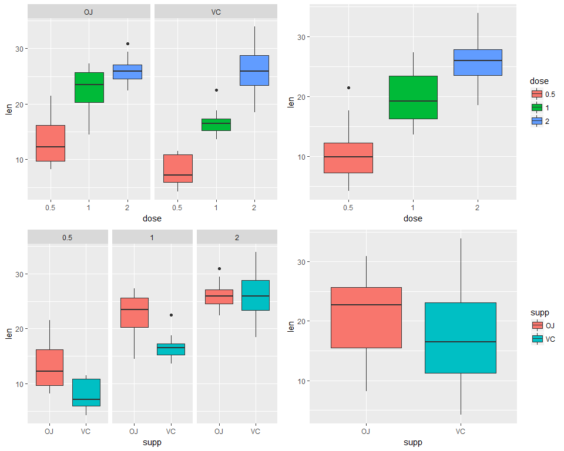

# StatInference_ToothGrowth_Project
Tom Polak  
December 20, 2017  


# Statistical Inference Course Project 2

## Overview
Load the ToothGrowth data and perform some basic exploratory data analyses 
- Provide a basic summary of the data.
- Use confidence intervals and/or hypothesis tests to compare tooth growth by supp and dose. (Only use the techniques from class, even if there's other approaches worth considering)
- State your conclusions and the assumptions needed for your conclusions. 


## Load Data


```r
# load neccesary libraries
library(ggplot2)
library(gridExtra)

# The Effect of Vitamin C on Tooth Growth in Guinea Pigs
data(ToothGrowth)
toothGrowth <- ToothGrowth 
toothGrowth$dose <- as.factor(toothGrowth$dose) # convert to factor
```


## Basic Summary of the data

```r
str(toothGrowth)
```

```
## 'data.frame':	60 obs. of  3 variables:
##  $ len : num  4.2 11.5 7.3 5.8 6.4 10 11.2 11.2 5.2 7 ...
##  $ supp: Factor w/ 2 levels "OJ","VC": 2 2 2 2 2 2 2 2 2 2 ...
##  $ dose: Factor w/ 3 levels "0.5","1","2": 1 1 1 1 1 1 1 1 1 1 ...
```

```r
summary(toothGrowth)
```

```
##       len        supp     dose   
##  Min.   : 4.20   OJ:30   0.5:20  
##  1st Qu.:13.07   VC:30   1  :20  
##  Median :19.25           2  :20  
##  Mean   :18.81                   
##  3rd Qu.:25.27                   
##  Max.   :33.90
```

```r
head(toothGrowth)
```

```
##    len supp dose
## 1  4.2   VC  0.5
## 2 11.5   VC  0.5
## 3  7.3   VC  0.5
## 4  5.8   VC  0.5
## 5  6.4   VC  0.5
## 6 10.0   VC  0.5
```

```r
table(toothGrowth$supp, toothGrowth$dose)
```

```
##     
##      0.5  1  2
##   OJ  10 10 10
##   VC  10 10 10
```

<!-- -->


Now we will run a t-test on the length of tooth and the supplement to see if there is any impact of delivery method.


```r
# run t-test
t.test(len~supp,data=toothGrowth)
```

```
## 
## 	Welch Two Sample t-test
## 
## data:  len by supp
## t = 1.9153, df = 55.309, p-value = 0.06063
## alternative hypothesis: true difference in means is not equal to 0
## 95 percent confidence interval:
##  -0.1710156  7.5710156
## sample estimates:
## mean in group OJ mean in group VC 
##         20.66333         16.96333
```

With a p-value of 0.06 and the 95% confidence interval containing 0, we cannot reject the null hypotheses. It would seem the delivery method of vitaman C has no impact on the length of tooth.

Next thing to look at is the impact to length based on the amount of Vitamin C they received (dose variable). To measure this, the three tests were run to compare the three different dosages to each other. 


```r
# run t-test using dose amounts 0.5 and 1.0
toothGrowth_sub <- subset(toothGrowth, toothGrowth$dose %in% c(1.0,0.5))
t.test(len~dose,data=toothGrowth_sub)
```

```
## 
## 	Welch Two Sample t-test
## 
## data:  len by dose
## t = -6.4766, df = 37.986, p-value = 1.268e-07
## alternative hypothesis: true difference in means is not equal to 0
## 95 percent confidence interval:
##  -11.983781  -6.276219
## sample estimates:
## mean in group 0.5   mean in group 1 
##            10.605            19.735
```

```r
# run t-test using dose amounts 0.5 and 2.0
toothGrowth_sub <- subset(toothGrowth, toothGrowth$dose %in% c(0.5,2.0))
t.test(len~dose,data=toothGrowth_sub)
```

```
## 
## 	Welch Two Sample t-test
## 
## data:  len by dose
## t = -11.799, df = 36.883, p-value = 4.398e-14
## alternative hypothesis: true difference in means is not equal to 0
## 95 percent confidence interval:
##  -18.15617 -12.83383
## sample estimates:
## mean in group 0.5   mean in group 2 
##            10.605            26.100
```

```r
# run t-test using dose amounts 1.0 and 2.0
toothGrowth_sub <- subset(toothGrowth, toothGrowth$dose %in% c(1.0,2.0))
t.test(len~dose,data=toothGrowth_sub)
```

```
## 
## 	Welch Two Sample t-test
## 
## data:  len by dose
## t = -4.9005, df = 37.101, p-value = 1.906e-05
## alternative hypothesis: true difference in means is not equal to 0
## 95 percent confidence interval:
##  -8.996481 -3.733519
## sample estimates:
## mean in group 1 mean in group 2 
##          19.735          26.100
```

As can be seen above, all three t-tests have a VERY small P-Value and none of the confidence intervals contain zero. 

Based on this result we can assume that the average tooth length increases with an inceasing dose, and therefore the null hypothesis can be rejected.

## Conclusions

Given the following assumptions:

* The sample is representative of the population
* The distribution of the sample means follows the Central Limit Theorem

In reviewing our t-test analysis from above, we can conclude that supplement delivery method has no effect on tooth growth/length, however increased dosages do result in increased tooth length.
